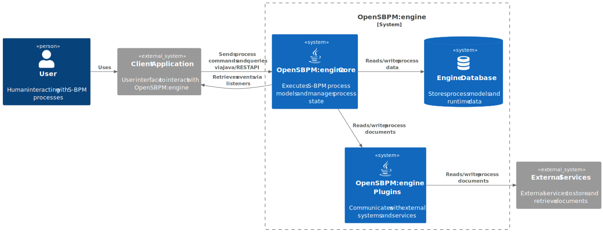
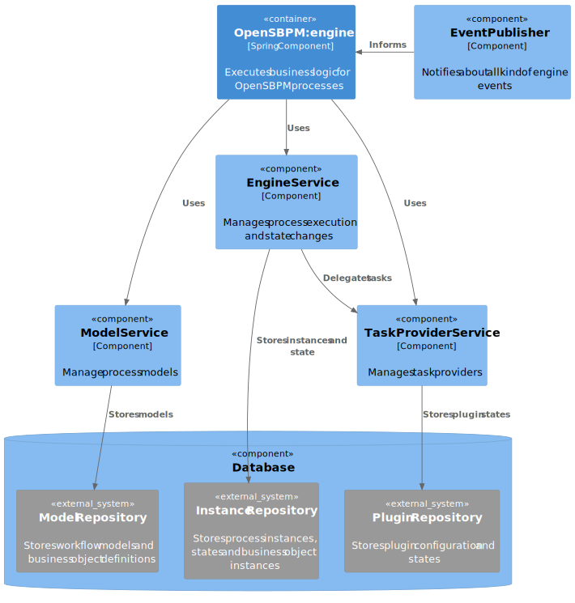

# Architecture

## System Context 

OpenSBPM:Engine is an execution engine for executing business processes 
defined in the OpenSBPM format. It is designed to be used both as a library
and as a REST API, allowing for flexible integration into various applications.
It is built using Java, Spring Boot, and Spring Data JPA, enabling it to persist 
data in relational databases like H2, PostgreSQL, and MariaDB. The engine can be 
extended with custom plugins to enhance its functionality.

- **User**: A human interacts with S-BPM processes through a client application.
- **Client Application**: Serves as the user interface, communicating with OpenSBPM:engine 
    via Java or REST APIs to send commands and queries, and to receive events. 
- **OpenSBPM:engine**: The core system, consisting of:
  - **Engine Core**: Executes S-BPM process models and manages process state.
  - **Engine Database**: Stores process models and runtime data.
  - **Engine Plugins**: Integrates with external systems and services.
- **External Services**: Systems outside OpenSBPM:engine, used for storing and retrieving documents.

### Main interactions:  
Users operate the client application. The client application communicates with 
the engine core. The engine core manages process data in the database and interacts 
with plugins for document handling. Plugins connect to external services for document 
storage and retrieval. 

## Core Components 
OpenSBPM:engine is designed to be modular and extensible, allowing for easy integration.

The architecture of the system is designed to be modular and scalable. It consists
of several key parts:  
- **OpenSBPM:engine** (Spring Component): The main application container that executes business logic for S-BPM processes.
  - **ModelService**: Manages process models and interacts with the Model Repository to store them.
  - **EngineService**: Handles process execution and state changes, storing process instances and states in the Instance Repository. It also delegates tasks to the TaskProviderService.
  - **TaskProviderService**: Manages task providers and stores plugin states in the Plugin Repository.
  - **EventPublisher**: Notifies about all kinds of engine events to the main application.
- **Database**: Contains three external repositories:
  - **Model Repository**: Stores workflow models and business object definitions.
  - **Instance Repository**: Stores process instances, states, and business object instances.
  - **Plugin Repository**: Stores plugin configuration and states.
### Relationships:  
The main application uses the ModelService, EngineService, and TaskProviderService. 
Each service interacts with its respective repository. EventPublisher informs the 
main application about events.

## Maven Modules
- **Core Engine** (core): The heart of the system, responsible for managing and executing processes.
- **API Layer** (api): Provides a programmatic interface for interacting with the engine.
- **REST API** (rest-api): Offers HTTP-based access to the engine's functionality
- **REST Client** (rest-client): Offers an Apache CXF based HTTPClient to communicate with REST API
- **XML Model** (xml-model): Provides support for modeling process definitions in XML format.
