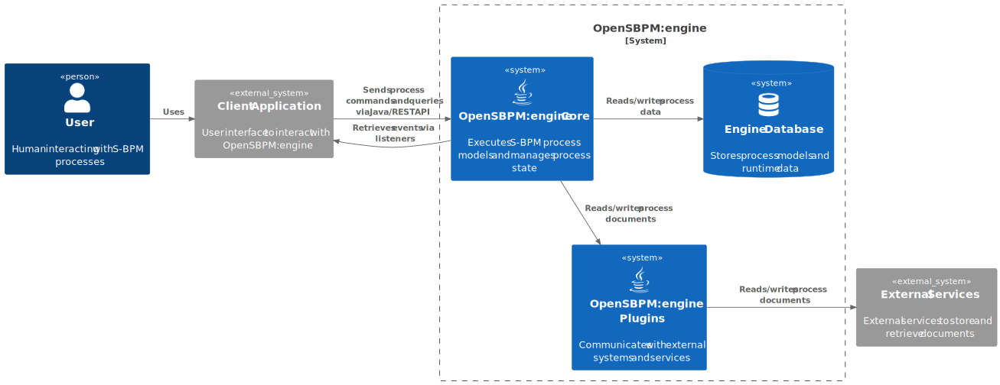

# Documentation

## Architecture 

OpenSBPM:Eninge is an execution engine for executing business processes 
defined in the OpenSBPM format. It is designed to be used both as a library
and as a REST API, allowing for flexible integration into various applications.
It is built using Java, Spring Boot, and Spring Data JPA, enabling it to persist data in relational databases like H2, PostgreSQL, and MariaDB.

The architecture of the system is designed to be modular and scalable. It consists of several key components:
- **Core Engine**: The heart of the system, responsible for executing business processes.
- **API Layer**: Provides a programmatic interface for interacting with the engine.
- **REST API**: Offers HTTP-based access to the engine's functionality
- **Database Layer**: Uses Spring Data JPA for persistence, supporting multiple relational databases like H2, PostgreSQL, and MariaDB.
- **User Management**: While the engine does not include built-in user management, it can be integrated with external systems to handle authentication and authorization.
